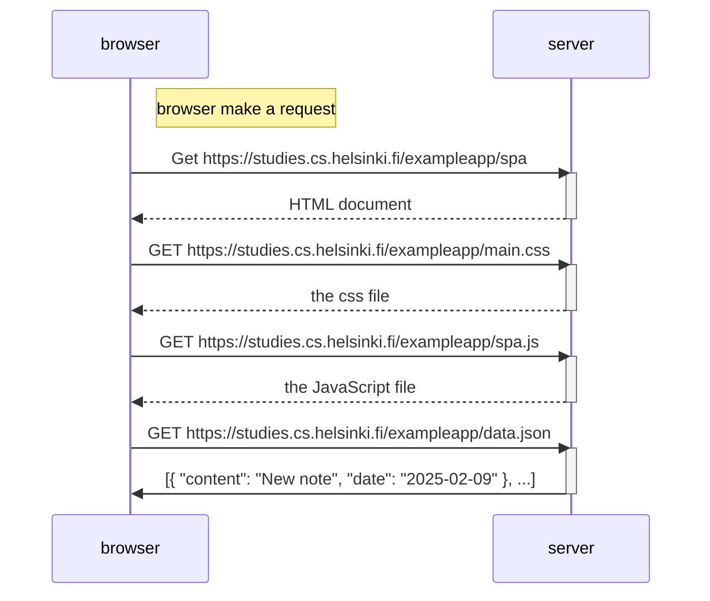

```mermaid
sequenceDiagram
    participant browser
    participant server


Note right of browser: browser make a request

browser->>server: Get https://studies.cs.helsinki.fi/exampleapp/spa
activate server
server-->>browser: HTML document
deactivate server

browser->>server: GET https://studies.cs.helsinki.fi/exampleapp/main.css
activate server
server-->>browser: the css file
deactivate server

browser->>server: GET https://studies.cs.helsinki.fi/exampleapp/spa.js
activate server
server-->>browser: the JavaScript file
deactivate server


browser->>server: GET https://studies.cs.helsinki.fi/exampleapp/data.json
activate server
server->>browser: [{ "content": "New note", "date": "2025-02-09" }, ...]
deactivate server


```
